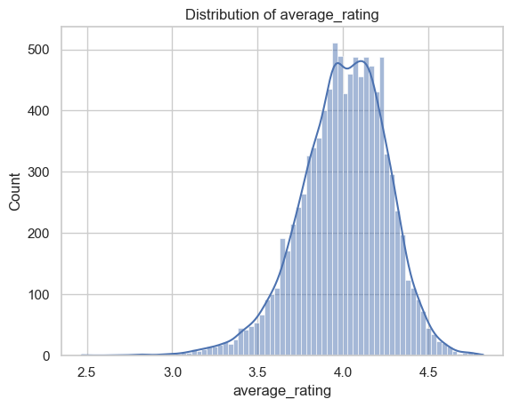

```markdown
# Data Analysis of Book Ratings Dataset

## Data Overview

The analysis focuses on a dataset containing information about books and their ratings from Goodreads. The dataset consists of 10,000 entries and 23 columns with various attributes related to each book.

- **Shape**: (10000, 23)
- **Columns**: 
  - `'book_id'`
  - `'goodreads_book_id'`
  - `'best_book_id'`
  - `'work_id'`
  - `'books_count'`
  - `'isbn'`
  - `'isbn13'`
  - `'authors'`
  - `'original_publication_year'`
  - `'original_title'`
  - `'title'`
  - `'language_code'`
  - `'average_rating'`
  - `'ratings_count'`
  - `'work_ratings_count'`
  - `'work_text_reviews_count'`
  - `'ratings_1'`
  - `'ratings_2'`
  - `'ratings_3'`
  - `'ratings_4'`
  - `'ratings_5'`
  - `'image_url'`
  - `'small_image_url'`

- **Data Types**:
  ```python
  {
      'book_id': 'int64',
      'goodreads_book_id': 'int64',
      'best_book_id': 'int64',
      'work_id': 'int64',
      'books_count': 'int64',
      'isbn': 'object',
      'isbn13': 'float64',
      'authors': 'object',
      'original_publication_year': 'float64',
      'original_title': 'object',
      'title': 'object',
      'language_code': 'object',
      'average_rating': 'float64',
      'ratings_count': 'int64',
      'work_ratings_count': 'int64',
      'work_text_reviews_count': 'int64',
      'ratings_1': 'int64',
      'ratings_2': 'int64',
      'ratings_3': 'int64',
      'ratings_4': 'int64',
      'ratings_5': 'int64',
      'image_url': 'object',
      'small_image_url': 'object'
  }
  ```

- **Missing Values**:
  ```python
  {
      'isbn': 700,
      'isbn13': 585,
      'original_publication_year': 21,
      'original_title': 585,
      'language_code': 1084
  }
  ```

## Analysis

### Summary Statistics

The descriptive statistics provide an overview of key metrics in the dataset:

- **Average Rating**: `4.00` with a standard deviation of `0.254`
- **Ratings Count**: Average is `54001.24`, max is `4780653`
- **Authors**: A total of `4664` unique authors identified in the dataset.

### Correlation Matrix

The following correlations were observed:
- There is a strong correlation between `ratings_count` and `work_ratings_count` with a correlation coefficient of `0.995`.
- `average_rating` negatively correlates with the total ratings given (1 to 5).

### Visualizations

To better understand the data distribution and relationships, various visualizations have been created:

- **Visualization Charts**:
  - 
  - 
  - 
  - 
  - 
  - 
  - 
  - 
  - 
  - 
  - 
  - 
  - 
  - 
  - 
  - 
  - 

## Conclusion

The analysis of the book ratings dataset provides significant insights into the distribution of ratings, the correlation between various metrics, and identifies areas that may require further investigation or cleaning, especially regarding missing values.

For further details or inquiries, please contact the data analyst.
```
