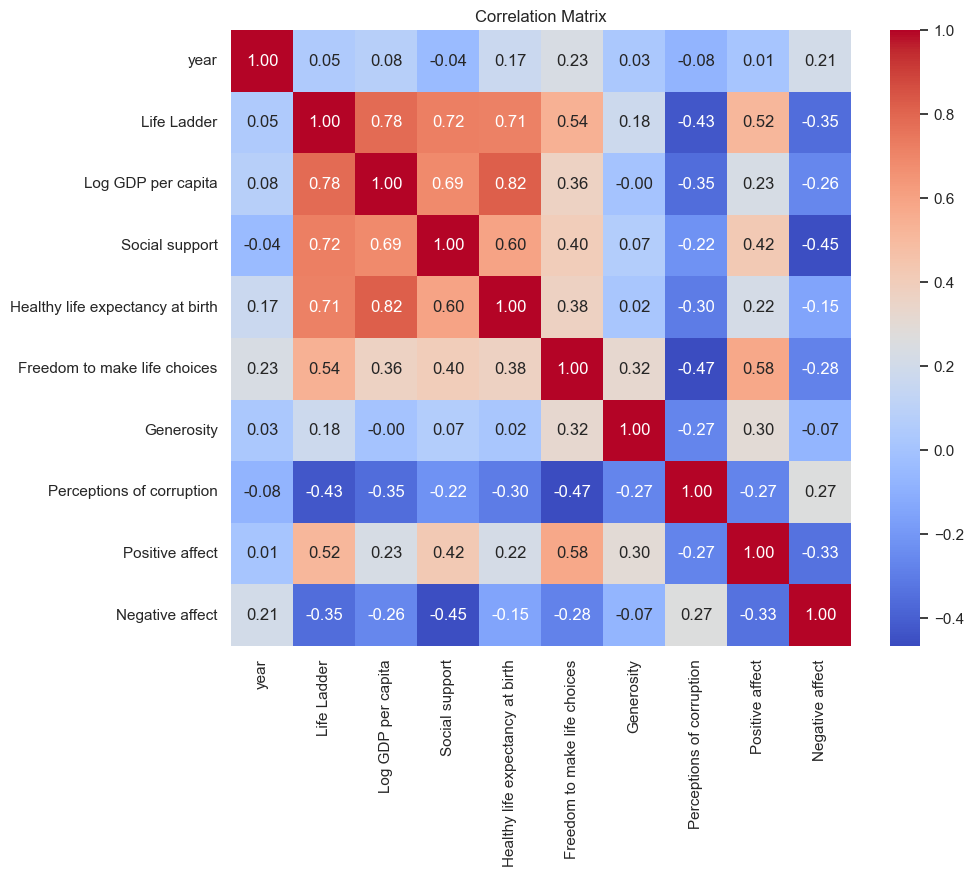
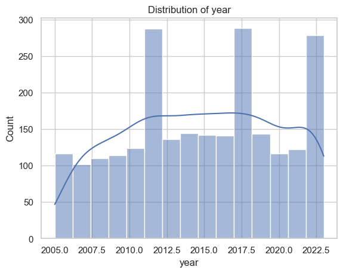
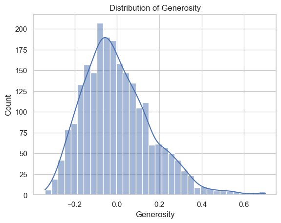

```markdown
# Data Analysis README

## Overview

This document provides a detailed overview of the analysis performed on a dataset containing various indicators related to well-being and life satisfaction across different countries and years. The dataset consists of 2363 rows and 11 columns, capturing information such as life ladder scores, economic factors, social support, and perceptions of corruption.

## Data Overview

- **Shape**: (2363, 11)
- **Columns**: 
  - `Country name`
  - `year`
  - `Life Ladder`
  - `Log GDP per capita`
  - `Social support`
  - `Healthy life expectancy at birth`
  - `Freedom to make life choices`
  - `Generosity`
  - `Perceptions of corruption`
  - `Positive affect`
  - `Negative affect`
- **Data Types**:
  - `Country name`: object
  - `year`: int64
  - `Life Ladder`: float64
  - `Log GDP per capita`: float64
  - `Social support`: float64
  - `Healthy life expectancy at birth`: float64
  - `Freedom to make life choices`: float64
  - `Generosity`: float64
  - `Perceptions of corruption`: float64
  - `Positive affect`: float64
  - `Negative affect`: float64
- **Missing Values**:
  - `Log GDP per capita`: 28
  - `Social support`: 13
  - `Healthy life expectancy at birth`: 63
  - `Freedom to make life choices`: 36
  - `Generosity`: 81
  - `Perceptions of corruption`: 125
  - `Positive affect`: 24
  - `Negative affect`: 16

## Analysis

### Summary Statistics

The summary statistics for the dataset provide insights into the distribution of key variables:

- **Year**:
  - Mean: 2014.76
  - Min: 2005
  - Max: 2023
  
- **Life Ladder**:
  - Mean: 5.48
  - Min: 1.28
  - Max: 8.02

- **Log GDP per capita**:
  - Mean: 9.40
  - Min: 5.53
  - Max: 11.68

- **Social Support**:
  - Mean: 0.81
  - Min: 0.23
  - Max: 0.99

- **Healthy Life Expectancy at Birth**:
  - Mean: 63.40
  - Min: 6.72
  - Max: 74.60

- **Freedom to Make Life Choices**:
  - Mean: 0.75
  - Min: 0.23
  - Max: 0.99
  
- **Generosity**:
  - Mean: 0.0001
  - Min: -0.34
  - Max: 0.70
  
- **Perceptions of Corruption**:
  - Mean: 0.74
  - Min: 0.035
  - Max: 0.98

- **Positive Affect**:
  - Mean: 0.65
  - Min: 0.18
  - Max: 0.88

- **Negative Affect**:
  - Mean: 0.27
  - Min: 0.08
  - Max: 0.71

### Correlation Analysis

The correlation matrix indicates the strength and direction of the relationships between different variables. Notable correlations include:

- Life Ladder and Log GDP per capita: **0.78**
- Life Ladder and Social support: **0.72**
- Life Ladder and Healthy life expectancy at birth: **0.71**
- Freedom to make life choices and Positive affect: **0.58**
- Perceptions of corruption and Negative affect: **0.27**

A strong negative correlation is observed between life ladder scores and perceptions of corruption: **-0.43**.

## Visualizations

The following visualizations have been created to illustrate key insights from the dataset:

1. 
2. 
3. 
4. 
5. 
6. 
7. 
8. 
9. 
10. 
11. 

## Conclusion

This analysis has uncovered various insights into the factors affecting life satisfaction and well-being across countries. The analyses highlight the relationships between economic indicators, social support, and subjective measures of well-being, revealing important dynamics that could inform policy and further research.
```
