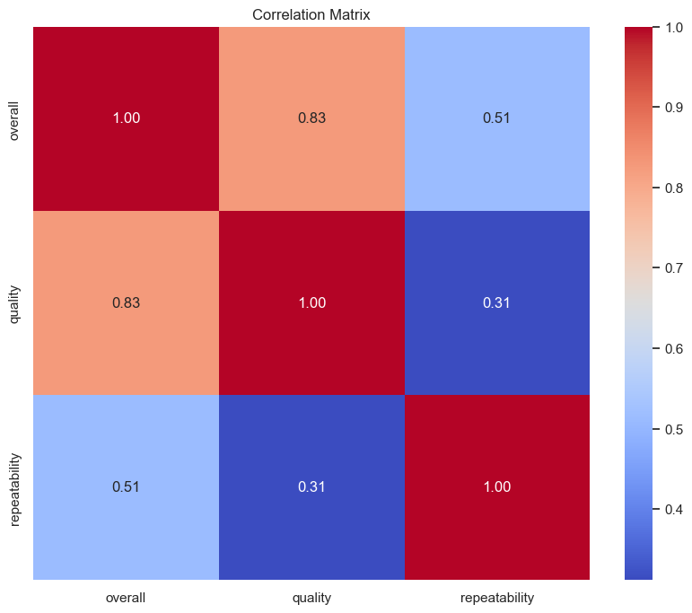
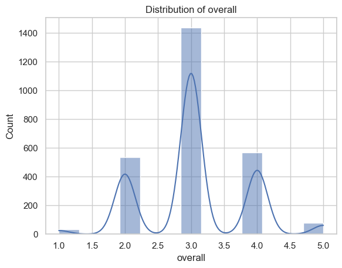
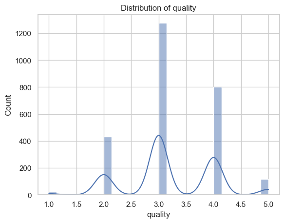
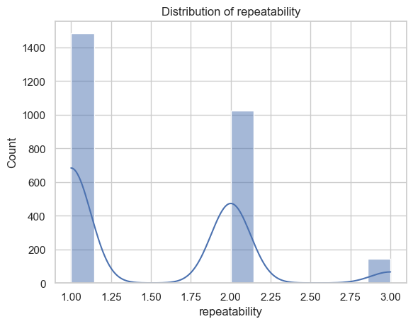

## Overview

This README provides an overview of the analysis conducted on a dataset containing 2652 records across 8 attributes. The dataset includes information related to various items (e.g., movies, shows) along with associated metrics.

## Dataset Details

### Shape
- **Total Records:** 2652
- **Total Columns:** 8

### Columns
- `date`: The date associated with the record (object type)
- `language`: The language of the item (object type)
- `type`: The type of the item (e.g., movie, show) (object type)
- `title`: The title of the item (object type)
- `by`: The creator or contributor of the item (object type)
- `overall`: Overall rating (integer type)
- `quality`: Quality rating (integer type)
- `repeatability`: Repeatability rating (integer type)

### Data Types
| Column       | Data Type |
|--------------|-----------|
| date         | object    |
| language     | object    |
| type         | object    |
| title        | object    |
| by           | object    |
| overall      | int64     |
| quality      | int64     |
| repeatability | int64     |

### Missing Values
| Column       | Missing Values |
|--------------|----------------|
| date         | 99             |
| language     | 0              |
| type         | 0              |
| title        | 0              |
| by           | 262            |
| overall      | 0              |
| quality      | 0              |
| repeatability | 0              |

## Analysis Summary

### Summary Statistics
The summary statistics for each column are as follows:

- **Date**
  - Count: 2553
  - Unique: 2055
  - Top: '21-May-06'
  - Frequency: 8
- **Language**
  - Count: 2652
  - Unique: 11
  - Top: 'English'
  - Frequency: 1306
- **Type**
  - Count: 2652
  - Unique: 8
  - Top: 'movie'
  - Frequency: 2211
- **Title**
  - Count: 2652
  - Unique: 2312
  - Top: 'Kanda Naal Mudhal'
  - Frequency: 9
- **By**
  - Count: 2390
  - Unique: 1528
  - Top: 'Kiefer Sutherland'
  - Frequency: 48
- **Overall**
  - Mean: 3.05
  - Standard Deviation: 0.76
  - Min: 1.0
  - Max: 5.0
- **Quality**
  - Mean: 3.21
  - Standard Deviation: 0.80
  - Min: 1.0
  - Max: 5.0
- **Repeatability**
  - Mean: 1.49
  - Standard Deviation: 0.60
  - Min: 1.0
  - Max: 3.0

### Correlation Matrix
The correlation between the numerical metrics is summarized as follows:

|          | Overall | Quality | Repeatability |
|----------|---------|---------|---------------|
| Overall  | 1.0     | 0.826   | 0.513         |
| Quality  | 0.826   | 1.0     | 0.312         |
| Repeatability | 0.513 | 0.312 | 1.0           |

## Visualizations
The following visualizations were created to provide insights into the dataset:

1. **Correlation Matrix**: A visual representation of correlation values between overall ratings, quality, and repeatability.
   - 

2. **Overall Rating Distribution**: Distribution of overall ratings among the records.
   - 

3. **Quality Rating Distribution**: Distribution of quality ratings among the records.
   - 

4. **Repeatability Rating Distribution**: Distribution of repeatability ratings among the records.
   - 

## Conclusion

The analysis provides important insights into the dataset’s characteristics, including its structure, missing values, summary statistics, and visualizations. The correlations indicate a significant relationship between the overall rating and quality, suggesting that items rated higher overall tend to also be rated higher in quality.

This analysis serves as a foundation for further explorations and investigations into the dataset, allowing for deeper insights into patterns or trends.
